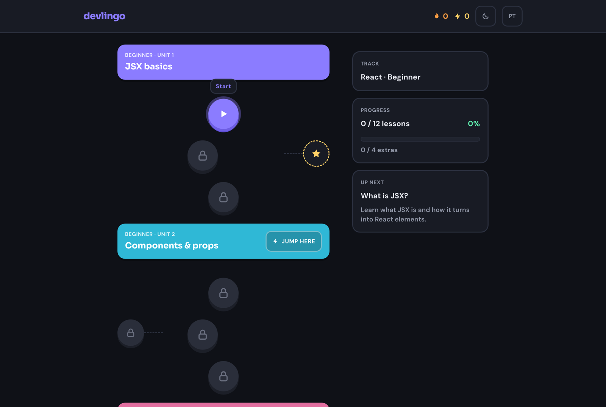
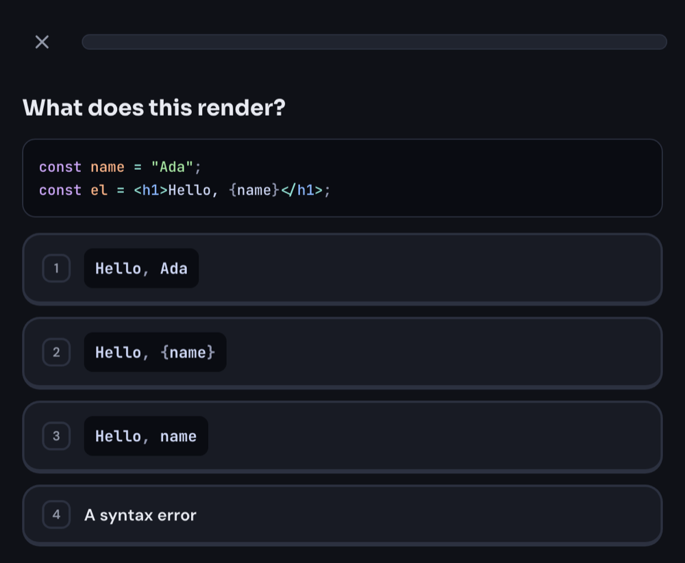

# devlingo

Duolingo-style lessons for learning technologies, built so that finishing a track means you can answer the questions an interview actually asks. The first track is React.

**[Try it →](https://devlingo-blue.vercel.app)**



## What it does

- **A visual path.** Units unlock in order; each lesson is a node you tap. XP, a daily streak, and a completion screen.
- **Short exercises, no code execution.** Multiple choice, multiple selection, and fill-in-the-blank over real snippets with syntax highlighting.
- **Jump here.** A locked unit can be unlocked early by passing a 15-question challenge on everything before it. Three mistakes allowed, 300 XP.
- **Side quests.** One optional bonus lesson beside each unit, worth double XP, covering what surrounds React — global state, server cache, routing — by the problem it solves rather than the library's name.
- **Keyboard first on desktop.** `1`–`9` pick an option, `Enter` checks and continues.
- **Hints.** Three per lesson; each reveals the next letter of a fill-in-the-blank answer.
- **English and Portuguese**, dark and light, and it works offline once loaded.



## Run it

```bash
fnm use
npm install
npm run dev
```

`npm run build` type-checks, runs the tests (content validation included) and builds the site. `npm install` points git at `.githooks`, so lint and tests run before every push.

## How it is put together

Next.js App Router, TypeScript, Tailwind. Every page is static; the only server-side piece is a redirect from `/` to a locale. Progress lives in the browser.

| Where                 | What                                                   |
| --------------------- | ------------------------------------------------------ |
| `src/content/`        | The tracks, as typed TypeScript. One file per unit.    |
| `src/lib/progress.ts` | The only module that touches localStorage.             |
| `src/lib/check.ts`    | Answer checking, pure and tested.                      |
| `src/components/`     | The track path, the lesson runner, the exercise types. |
| `src/i18n/`           | Hand-rolled `t()` plus one message catalog per locale. |

## Add content

A track has levels, levels have units. A unit has three lessons of 5 to 7 exercises, a 15-question challenge, and one side quest.

```ts
{
  id: "jsx-basics-1",
  title: { en: "What is JSX?", "pt-BR": "O que é JSX?" },
  description: { en: "Learn what JSX is and how it turns into React elements.", "pt-BR": "…" },
  xp: 20,
  exercises: [
    {
      type: "single-choice",
      prompt: { en: "What does the `key` prop do?", "pt-BR": "O que a prop `key` faz?" },
      code: "const el = <h1>Hi</h1>;",
      options: [{ en: "…", "pt-BR": "…" }],
      correct: 2,
    },
  ],
}
```

The test suite checks three numbered lessons per unit, XP 20/30/30, 5–7 exercises per lesson or extra, a fill-blank and a multi-choice in each, translated prompts and lesson text, balanced backticks, and varied answer positions. A `fill-blank` has exactly one `___` and a single-token answer. Every extra gives 60 XP; every unit after the first has a 15-question challenge on preceding units.

Prose options include both `en` and `pt-BR`; code options use only `en`. This convention also selects how an option is rendered, so reviewers must check that prose is not accidentally marked as code and that inline identifiers use backticks. Answer correctness and topic coverage need review against the React docs. Lesson ids are permanent, because they live in people's saved progress.

Run `npm test` while writing — a broken lesson fails the build before it can ship.

## Where it is going

`docs/react-interview-coverage.md` maps 110 real interview questions onto the track and is the acceptance criterion for each unit. Five of 27 units have content today; the rest show as "coming soon". Next up: Conditional rendering and Forms, followed by the remaining levels. A service worker for installation and offline use is a separate future feature.
